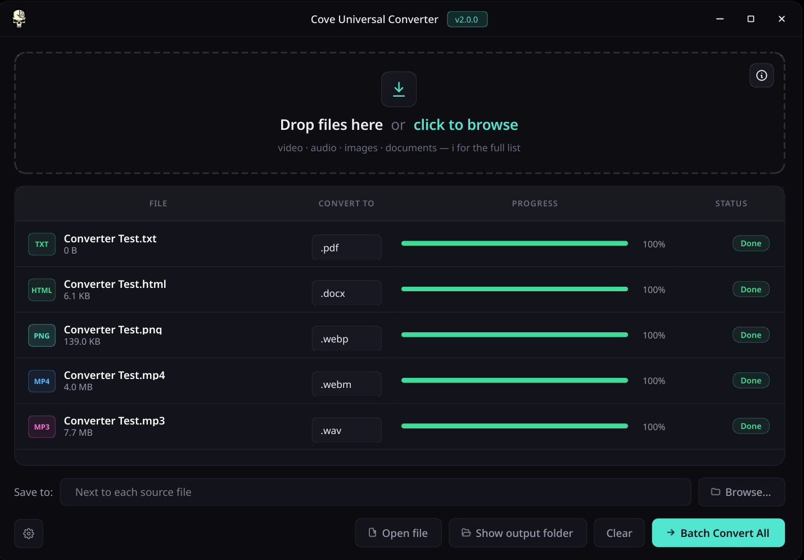

# Cove Universal Converter

An offline, privacy-first batch file converter. Drop in video, audio, images,
or documents and convert between 40+ formats — no files leave your machine.



One codebase, one repository, two native builds: a Windows `.exe` and a Linux
binary. Everything below assumes you're starting from a fresh clone:

```
git clone <your-repo-url>
cd cove-universal-converter
```

---

## v2.0.0 — Cove redesign

The UI has been rebuilt around the Cove design language shared with the rest
of the Cove app suite:

- **Frameless window with custom title bar** — Cove icon, centered title with a
  monospace `v2.0.0` chip, and min/max/close controls (no traffic lights). Drag
  the bar to move, double-click to maximize, grab any edge to resize.
- **Teal accent on a dark navy surface**, Geist / Geist Mono fonts when available
  (with system fallbacks).
- **Redesigned drop zone** — dashed border that lights up teal on hover/drag,
  gradient art tile, and a corner info button that pulls up the full
  format-support list.
- **Format-tinted file badges** in the queue: video = blue, audio = pink,
  images = teal, documents = green — so a glance tells you what kind of file
  each row is.
- **Animated progress bars and status chips** — Ready / Queued / Processing /
  Done / Failed states each have their own color and tint.
- **Restyled Quality dialog** — segmented controls for video preset and audio
  bitrate, sliders for image quality and max concurrency, advanced row for
  fine-grained CRF / WebP tuning.
- **Toast notifications** for "Added N files", "Quality settings saved",
  "All N conversions complete", etc.

### New conversions in v2.0.0

- **PDF → DOCX / ODT / RTF / EPUB** is now supported. The PDF text is extracted
  with `pypdf`, then piped through pandoc to the target document/ebook
  format. Output is text-only (the original PDF formatting is dropped — that
  always loses fidelity), but you can edit the result in Word, LibreOffice, or
  any RTF/EPUB-aware reader.
- **PDF → MD / HTML / TXT** (already worked, retained).
- The PDF target dropdown in the queue now lists `.docx, .odt, .rtf, .epub,
  .md, .html, .txt` — pick whichever document tooling you want to land in.
- **Subtitles — SRT ↔ VTT.** Pure-stdlib worker that handles the timestamp
  punctuation difference (`,` vs `.`), strips/synthesises cue indices, and
  drops VTT-only `NOTE` / `STYLE` / `REGION` blocks on the way to SRT.
- **Spreadsheets — CSV ↔ XLSX.** Backed by `openpyxl`; round-trips plain
  tabular data faithfully (formulae and formatting are dropped on purpose,
  the goal is interchange not workbook cloning).
- **Archives — ZIP ↔ TAR ↔ TGZ.** Stdlib `zipfile` + `tarfile`; extracts to
  a temp dir then repacks. Uses `filter='data'` on extract (Python 3.12+) to
  block path traversal / symlink escapes.
- **Data interchange — JSON ↔ YAML.** `yaml.safe_load` / `safe_dump` only,
  so untrusted YAML can't construct arbitrary Python objects.

Each new format type has its own UI badge color (lavender for subtitles,
mint for spreadsheets, gold for archives, indigo for data) so the queue
still tells you what kind of file each row is at a glance.

### Optimizations and fixes shipped with v2.0.0

- **HiDPI-aware icons.** The Cove title-bar icon and every inline-SVG button
  icon are now rendered at `size × devicePixelRatio` and tagged with the right
  `setDevicePixelRatio`, so they stay crisp on 1.25× / 1.5× / 2× displays
  instead of being bilinearly blurred.
- **Visible icon tints.** Inline SVGs that used `stroke="currentColor"` were
  silently rasterizing to near-black on the dark surface (Qt's
  `QSvgRenderer` falls back to black for `currentColor` outside a
  CSS-painted document). Every icon now substitutes an explicit tint at
  rasterization time, so the title-bar min/max/close, the drop-zone info
  button, and the empty-state file icon are clearly visible.
- **SVG pixmap cache.** Inline SVGs are rasterized once per `(svg, size, color)`
  combo and reused — opening a file dialog or quality dialog no longer
  re-renders the same chrome icons.
- **Stylesheet repolish guard.** Progress ticks (~5×/sec per active row) and
  status updates only re-polish the Qt stylesheet when the chip/bar state
  actually changes, instead of on every value update.
- **Resize cursor no longer sticks.** With a translucent frameless window the
  main window's `mouseMoveEvent` only fires over the 6 px margin, so leaving
  that margin into a child widget never reset the cursor. The chrome widget
  now has an event filter that clears the cursor on `Enter`, and the move
  handler uses `unsetCursor()` so children's own cursors take over again.
- **"Open file" + "Show output folder" buttons.** When a batch finishes with
  at least one successful conversion, two ghost buttons appear in the action
  row: "Open file" launches the most recent converted file in your default
  app, "Show output folder" opens the destination directory in your system
  file manager. Both go through `QDesktopServices.openUrl` so they work on
  Linux, Windows, and macOS.
- **Per-row right-click menu.** Right-clicking a Done row offers "Open file"
  and "Show in folder" actions for that specific file — useful when a batch
  produced several outputs and you want to open one that isn't the most
  recent. The existing "Remove" item still works for any selection.
- **Toast no longer overlaps the action row.** Pinned to the top-center of
  the window (just below the title bar) so it doesn't hide the new button.
- **Toast lifecycle fix.** The fade-out animation finished signal is wired
  once at construction time instead of reconnecting every show, eliminating
  the slow per-toast handler accumulation.
- **Centralized theme.** A single `cove_converter/ui/theme.py` owns the palette
  and global stylesheet, applied once to the `QApplication` — replaces the per-
  widget QSS strings each Qt widget used to carry.

### "Can it match cloudconvert.com?"

Cloudconvert supports ~200 formats across 24 categories backed by a fleet of
cloud workers (LibreOffice headless, ImageMagick, Calibre, FFmpeg, pandoc,
ghostscript, plus their own engines). Cove already covers the FFmpeg + Pillow
+ pandoc + xhtml2pdf intersection of that — a meaningful slice of what most
people actually convert (A/V, common images, common docs, ebooks). Categories
that still aren't supported and would each need their own engine:

- **Spreadsheets**: xlsx ↔ csv ↔ ods (would add `openpyxl` / pandas).
- **Presentations**: pptx ↔ pdf ↔ odp (LibreOffice headless is the realistic path).
- **Archives**: zip / tar / 7z (pure-Python `zipfile`, `tarfile`, `py7zr`).
- **Vector**: svg ↔ png/pdf (`cairosvg` or `svglib`).
- **CAD / fonts / 3D / etc.**: each of these is its own world.

If any of those categories is interesting to you, file a request and I'll add
it the same way the existing engines are wired — one module under
`cove_converter/engines/`, one entry per format in `routing.py`.

---

## What it can do

| Category      | Supported extensions                                                               |
| ------------- | ---------------------------------------------------------------------------------- |
| Video         | mp4, mkv, webm, mov, avi, flv, wmv, m4v, mpg, mpeg, 3gp, ts, gif                   |
| Audio         | mp3, wav, flac, ogg, m4a, aac, opus, wma, aiff                                     |
| Images        | png, jpg, jpeg, webp, bmp, tiff, tif, ico, heic, heif                              |
| Documents     | pdf, docx, odt, rtf, epub, md, html, htm, txt, tex                                 |
| Subtitles     | srt, vtt                                                                           |
| Spreadsheets  | csv, xlsx                                                                          |
| Archives      | zip, tar, tgz                                                                      |
| Data          | json, yaml, yml                                                                    |

PDF works in **both directions**: any of the document formats above can be
rendered into a PDF, and a PDF can be exported back out to docx, odt, rtf,
epub, md, html, or txt. PDF → doc-family conversions extract the text via
pypdf and pipe it through pandoc, so the original visual layout is dropped
in favor of clean editable structure.

Features:

- Drag-and-drop, click-to-browse, or drop a whole folder (recurses automatically).
- Per-file target dropdown, or use the "Save to" field to batch-write to one folder.
- Near-lossless quality by default (CRF 17, preset slow, 320 kbps audio, 95%
  JPEG/WebP). An opt-in "Customize quality settings" checkbox exposes sliders
  if you'd rather trade quality for smaller files.
- Real-time progress bars parsed from FFmpeg's output.
- Overwrite confirmation with optional auto-rename to `file (1).ext`, `file (2).ext`, …
- Right-click a row (or press Delete) to remove it from the queue.

---

## Running from source (Linux)

You need Python 3.11 or newer. On Arch:

```bash
sudo pacman -S python ffmpeg pandoc
```

Set up a virtual environment and install the Python dependencies:

```bash
python -m venv .venv
.venv/bin/pip install -r requirements.txt
```

Launch the app:

```bash
./run.sh
# or, equivalently:
.venv/bin/python -m cove_converter
```

Always launch through the venv interpreter (`./run.sh` enforces this).
Running plain `python -m cove_converter` against your system Python will
silently skip optional deps like `xhtml2pdf` and produce confusing
mid-conversion failures (e.g. TXT → PDF appearing to fail at 60%).

FFmpeg and Pandoc are resolved from your system `PATH` when the app isn't
running as a packaged build.

---

## Running from source (Windows)

You need Python 3.11+ from [python.org](https://www.python.org/downloads/).
During installation, tick **"Add Python to PATH"**.

Install FFmpeg and Pandoc:

- **FFmpeg**: download a release from [gyan.dev](https://www.gyan.dev/ffmpeg/builds/),
  unzip it, and add the `bin\` folder to your `PATH`, **or** drop `ffmpeg.exe`
  into `bin\win\` inside this repo.
- **Pandoc**: grab the installer from [pandoc.org](https://pandoc.org/installing.html)
  and run it — the installer adds it to `PATH` automatically.

Then in PowerShell from the repo root:

```powershell
py -m venv .venv
.venv\Scripts\pip install -r requirements.txt
.venv\Scripts\python -m cove_converter
```

---

## Building release artifacts

PyInstaller can't cross-compile, so Linux artifacts have to be built on Linux
and Windows artifacts on Windows. Each platform has its own build script that
downloads ffmpeg / pandoc automatically and produces the final files.

### Linux — AppImage + .deb

```bash
bash scripts/build-release.sh
# Output in release/:
#   Cove-Universal-Converter-2.0.0-x86_64.AppImage
#   cove-universal-converter_2.0.0_amd64.deb
```

Override the version with `VERSION=2.0.1 bash scripts/build-release.sh`.

### Windows — Setup.exe + Portable.exe

Requires [Inno Setup 6](https://jrsoftware.org/isdl.php) to be installed
(bundled on GitHub Actions' `windows-latest`).

```powershell
.\build.ps1 -Version 2.0.0
# Output in release\:
#   cove-universal-converter-2.0.0-Setup.exe
#   cove-universal-converter-2.0.0-Portable.exe
```

### Automated release via GitHub Actions

Push a tag matching `v*` (e.g. `v1.0.0`) and
`.github/workflows/release.yml` runs the matrix:

- `build-linux` produces the AppImage + .deb on `ubuntu-latest`.
- `build-windows` produces Setup.exe + Portable.exe on `windows-latest`.

Both jobs attach their artifacts to the GitHub Release created for the tag,
using the body from `.github/RELEASE_NOTES_v<version>.md`.

---

## Project layout

```
cove-universal-converter/
├── cove_converter/
│   ├── __main__.py          # entry point (python -m cove_converter)
│   ├── binaries.py          # resolves ffmpeg/pandoc per-OS
│   ├── routing.py           # SUPPORTED_FORMATS table
│   ├── settings.py          # ConversionSettings dataclass
│   ├── engines/             # one worker per backend
│   │   ├── base.py          # BaseConverterWorker(QThread)
│   │   ├── ffmpeg.py        # video + audio
│   │   ├── pillow.py        # images (+ pillow-heif for HEIC)
│   │   ├── pandoc.py        # document formats
│   │   └── pdf.py           # any conversion touching .pdf
│   └── ui/                  # PySide6 widgets and dialogs
├── bin/
│   ├── linux/               # drop ffmpeg + pandoc here for local Linux builds
│   └── win/                 # drop ffmpeg.exe + pandoc.exe here for Windows
├── cove_converter.spec      # PyInstaller spec (branches on sys.platform)
├── .github/workflows/       # cross-platform CI
├── requirements.txt
└── pyproject.toml
```

---

## Troubleshooting

**"Could not find ffmpeg" on launch**
System has neither a PATH install nor a bundled binary. Install ffmpeg via
your package manager, or drop the binary into `bin/linux/` or `bin\win\`.

**HEIC files won't open**
Make sure `pillow-heif` was installed (`pip install -r requirements.txt`).
Some ancient HEIC files from older iPhones use HEVC Range Extensions and
still fail — convert them with another tool first.

**PDF output looks plain**
We render PDFs via xhtml2pdf (pure Python, no LaTeX dependency). That trades
some typographical polish for a zero-friction cross-platform install. If you
want LaTeX-quality PDFs, install a TeX distribution and switch the PDF engine.

**Windows console window flashes during conversion**
Shouldn't happen — we pass `CREATE_NO_WINDOW` to every subprocess. If you see
one, please open an issue with your Python and PySide6 versions.
